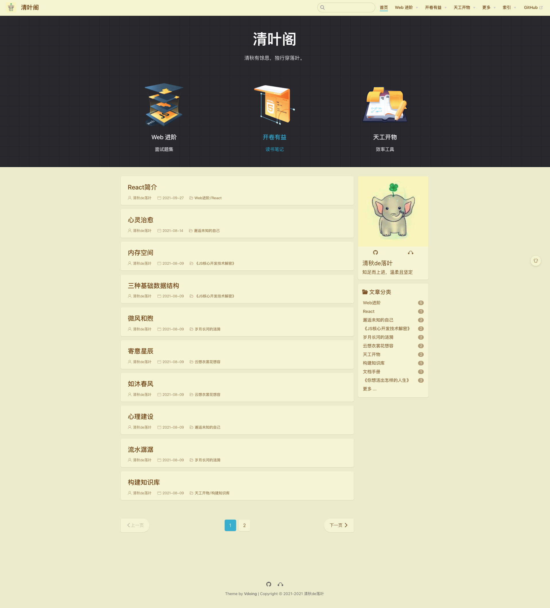
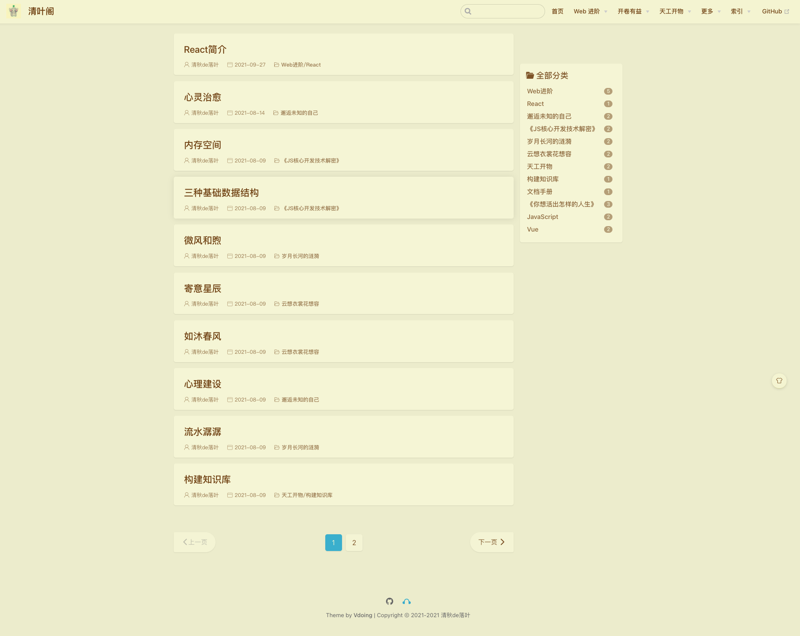

# vuepress-vdoing

一个基于 Vdoing 主题改进的 VuePress 博客。

```bash
# 安装 Git、Node.js

$ git clone git@github.com:wangwei664/vuepress-vdoing.git # 克隆源码
$ cd vuepress-vdoing # 进入项目目录
$ yarn install # 安装依赖
$ yarn run dev # 启动本地预览

# 浏览器访问本地启动的预览地址

# 部署项目到 GitHub Pages
$ chmod 755 ./deploy.sh # 修改部署脚本执行全县
$ ./deploy.sh # 执行部署
```

  

